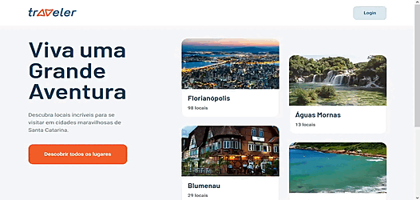

 
 
<h1 align='center'>Travaler</h1>

 <a href="#about">Sobre</a> •
 <a href="#tecnologias">Tecnologias</a> •
 <a href="#projeto">Projeto</a> • 
 <a href="#autor">Autor</a>

 
 

 
 
<h1 id='about'>📓Sobre</h1>

  Este projeto foi criado para botar em prática meu conhecimento sobre o frameworok Vuejs.
  O projeto ainda está em desenvolvimento, atualmente os dados estão vindo de um fake API criada com MirageJS.

 
 
<h1 id='tecnologias'>👨🏿‍💻Tecnologias</h1>

  <ul>
    <li>Vue</li>
    <li>Typescript</li>
    <li>SASS</li>
    <li>MirageJS</li>
  </ul>

 
 
<h1 id='projeto'>🔗Projeto</h1>

  Link para o projeto na vercel: <a>https://traveler-vue.vercel.app//</a>

 
 
<h1 id='autor'>👨🏿‍🦱Autor</h1>

<a href="https://www.linkedin.com/in/juan-lemos-75830b1a2/" title="Linkedin"> <h3>Juan Lemos 👨🏿‍💻</h3></a>

  Feito com ❤️ por Juan Lemos 👋🏽 Entre em contato!

  
  
   

